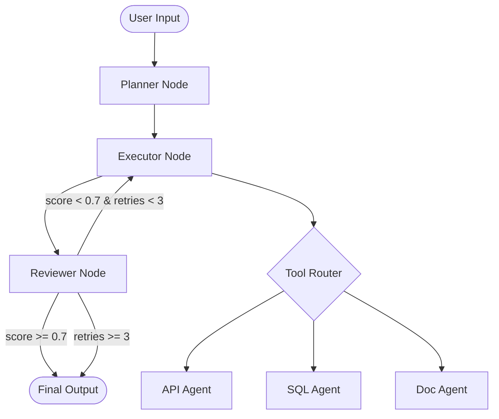

# Architecture — nvidia-nim-agent-toolkit

## Overview

A multi-agent coordination system powered by NVIDIA NIM inference microservices
and LangGraph orchestration. The core pattern is **Planner → Executor → Reviewer**
with a conditional retry loop.

## Agent Flow

## Components

| Component | Path | Responsibility |
|---|---|---|
| NIM Client | `nim/client.py` | OpenAI-compatible wrapper for NIM endpoints |
| State Schema | `orchestrator/state.py` | TypedDict shared state across all nodes |
| Graph | `orchestrator/graph.py` | LangGraph StateGraph wiring |
| Planner | `orchestrator/nodes/planner.py` | Decomposes intent into subtasks |
| Executor | `orchestrator/nodes/executor.py` | Dispatches tool calls per task |
| Reviewer | `orchestrator/nodes/reviewer.py` | Scores output, routes retry or done |
| API Agent | `agents/api_agent.py` | REST API tool-calling agent |
| SQL Agent | `agents/sql_agent.py` | Text-to-SQL agent |
| Doc Agent | `agents/doc_agent.py` | Vector store retrieval agent |

## Cross-Repo Conventions

- **Secrets:** `.env.template` committed, `.env` gitignored
- **Observability:** LangSmith tracing on all LLM call paths
- **CI/CD:** GitHub Actions — ruff + mypy + pytest on push
- **Containers:** `docker-compose.yml` with health checks
- **Python:** 3.11+
