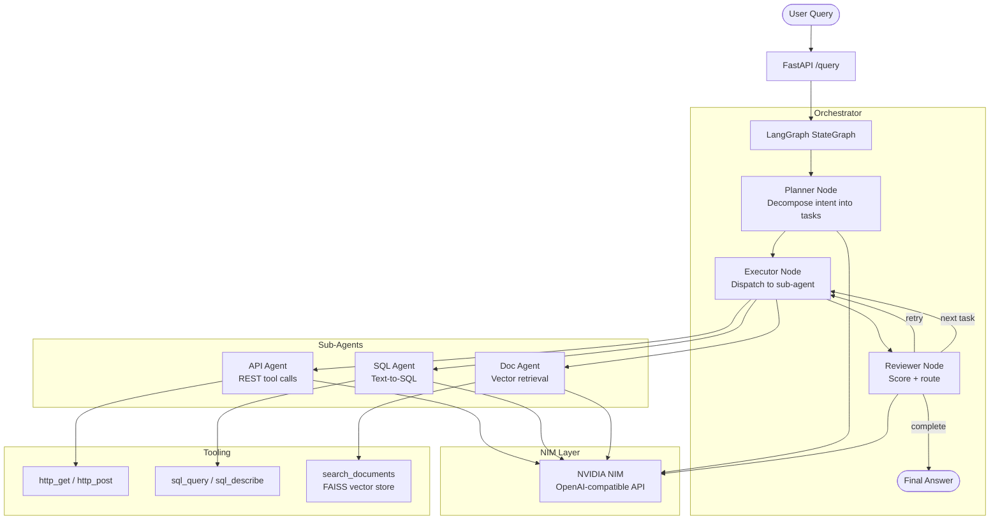

# NIM Agent Toolkit — Architecture

## System Overview

The `nvidia-nim-agent-toolkit` is a multi-agent coordination system powered by
NVIDIA NIM inference microservices and LangGraph orchestration.

## Component Diagram



## State Flow

```
AgentState
  user_query          → set at entry, never mutated
  task_list           → populated by Planner
  current_task_index  → incremented by Reviewer on accept
  task_results        → appended by Executor
  reviewer_score      → set by Reviewer
  retry_count         → incremented on retry, reset on advance
  routing_key         → drives conditional edges
  final_answer        → set by Reviewer on completion
```

## NIM Integration Pattern

All LLM calls route through `nim/client.py` via the OpenAI-compatible REST API.
Agent models, prompts, tools, and iteration caps live in `configs/agents.yaml`
and are validated at startup by `configs/loader.py` — no Python code changes are
needed to swap a model or edit a prompt.

```python
from nim.client import NIMClient

llm = NIMClient(model="meta/llama-3.1-70b-instruct").as_langchain_llm()
response = await llm.ainvoke(messages, config={"callbacks": get_callbacks()})
```

Tracing is attached to every LangChain invocation via the Langfuse
`CallbackHandler` returned by `nim.client.get_callbacks()`.

## Cross-Repo Integration

| Repo | Integration point |
|---|---|
| `enterprise-rag-pipeline` | `DocAgent` can delegate retrieval to the RAG pipeline |
| `agentic-guardrails-eval` | Eval suite points at `/query` endpoint as test target |
| `inference-optimization-bench` | NIM backend benchmarked via `nim/client.py` patterns |
