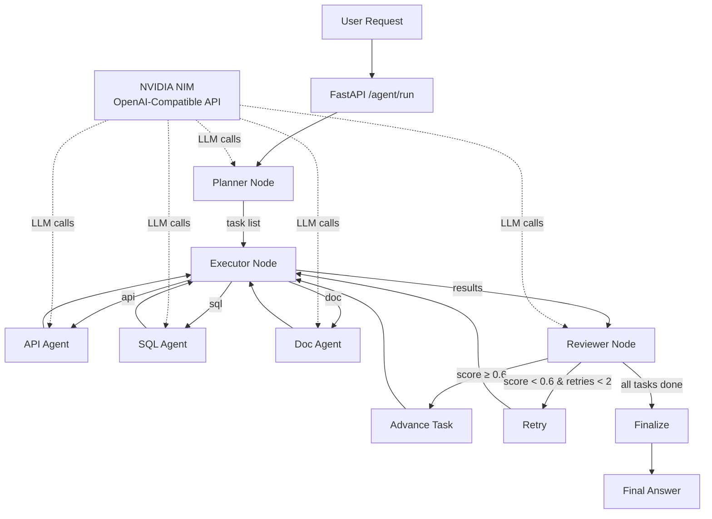

# Architecture — nvidia-nim-agent-toolkit

## Overview

This toolkit implements a **Planner → Executor → Reviewer** multi-agent loop
orchestrated via LangGraph. All LLM inference routes through NVIDIA NIM
microservices via their OpenAI-compatible REST API.

## Component Diagram



## Data Flow

1. **FastAPI** receives `{user_request}` and initialises `AgentState`.
2. **Planner** calls NIM to decompose the request into `tasks[]`.
3. **Executor** dispatches each task to the correct tool agent (API / SQL / Doc).
4. **Reviewer** scores the result; conditional edges decide to retry, advance, or finalise.
5. **Finalize** node assembles `final_answer` from all collected results.

## NIM Integration

`nim/client.py` wraps any NIM endpoint via `langchain_openai.ChatOpenAI`:

```python
from nim.client import NIMClient
llm = NIMClient().get_llm()          # points to NIM_BASE_URL
response = llm.invoke(messages)      # standard LangChain call
```

Swap models by editing `nim/config.yaml` — no Python changes needed.

## State Schema

See `orchestrator/state.py` — `AgentState` is a LangGraph `TypedDict`
carrying messages, task list, results, reviewer score, and retry count.

## Key Design Decisions

| Decision | Rationale |
|---|---|
| NIM via OpenAI-compat API | Zero vendor lock-in; swap any OpenAI SDK model |
| LangGraph StateGraph | Explicit state + conditional edges = auditable loops |
| StructuredTool wrappers | Pydantic schemas for tool inputs = safe, typed calls |
| YAML agent configs | Persona/model swap without code changes = ISV-friendly |
| FastAPI wrapper | Standard REST surface for enterprise integration |
