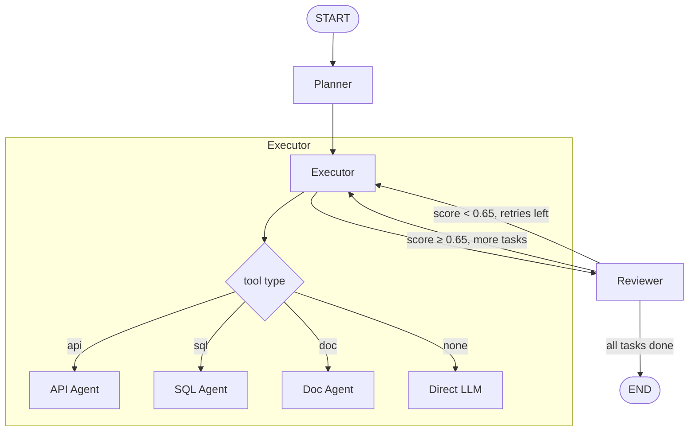

# Architecture — NVIDIA NIM Agent Toolkit

## Overview

The toolkit implements a **Planner → Executor → Reviewer** (PER) multi-agent loop
built on LangGraph, with all LLM inference routed through NVIDIA NIM microservices
via the OpenAI-compatible REST API.

## Graph Topology



## Component Map

| Layer | Module | Responsibility |
|-------|--------|----------------|
| NIM Client | `nim/client.py` | OpenAI-compat wrapper for NIM endpoints |
| State | `orchestrator/state.py` | Shared `TypedDict` state schema |
| Planner | `orchestrator/nodes/planner.py` | Decomposes intent → JSON task list |
| Executor | `orchestrator/nodes/executor.py` | Routes tasks to specialist agents |
| Reviewer | `orchestrator/nodes/reviewer.py` | Scores outputs, drives retry/advance logic |
| Graph | `orchestrator/graph.py` | Wires all nodes into compiled LangGraph |
| API Agent | `agents/api_agent.py` | REST API tool-calling agent |
| SQL Agent | `agents/sql_agent.py` | Text-to-SQL + query execution agent |
| Doc Agent | `agents/doc_agent.py` | Semantic search + grounded Q&A agent |
| API Server | `api/server.py` | FastAPI HTTP interface |
| Evals | `evals/agent_eval.py` | Correctness + Langfuse tracing harness |

## Data Flow

```
POST /v1/run {intent}
  └─ graph.run(intent)
       ├─ planner_node  → task_list: [{id, description, tool, depends_on}, ...]
       ├─ executor_node → dispatches to ApiAgent / SqlAgent / DocAgent / LLM
       ├─ reviewer_node → score, reason → route: continue | retry | done
       └─ final_answer (synthesis of all task_results)
```

## NIM Integration

All LLM calls go through `nim/client.py`, which wraps LangChain's `ChatOpenAI`
pointed at `NIM_BASE_URL`. Swapping between NVIDIA-hosted NIM and a self-hosted
instance requires only a `.env` change — no code modifications.

Supported model configs are defined in `nim/config.yaml`. The `NIMClient.from_config()`
classmethod allows per-agent model selection from `configs/agents.yaml`.

## Extending the Toolkit

1. **Add a new tool type**: Create a `tools/your_tools.py` with `StructuredTool` wrappers,
   add a new agent in `agents/`, and add the routing case to `executor.py`.
2. **Swap the model**: Update `configs/agents.yaml` — no Python changes needed.
3. **Add eval cases**: Append `EvalCase` entries to `DEFAULT_EVAL_SUITE` in `evals/agent_eval.py`.
4. **Deploy**: `docker-compose up` in `deploy/` — pgvector and the toolkit server start together.
