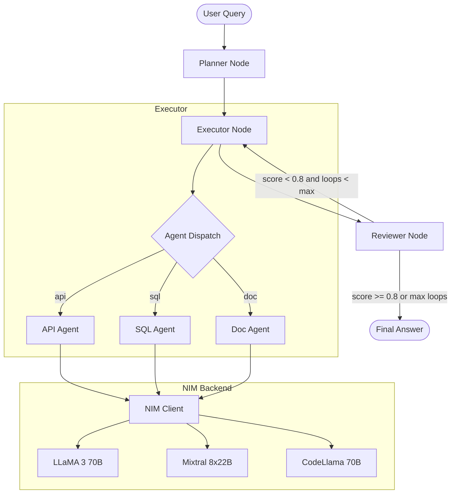

# Architecture — nvidia-nim-agent-toolkit

## Overview

This toolkit implements a **Planner → Executor → Reviewer (PER)** multi-agent loop
orchestrated by LangGraph, with NVIDIA NIM providing the inference backend.

## Agent Flow

## Component Descriptions

| Component | File | Responsibility |
|-----------|------|----------------|
| NIM Client | `nim/client.py` | OpenAI-compatible wrapper with Langfuse tracing |
| State Schema | `orchestrator/state.py` | TypedDict — single source of truth for graph state |
| Graph | `orchestrator/graph.py` | LangGraph StateGraph wiring all nodes |
| Planner | `orchestrator/nodes/planner.py` | Decomposes query into subtasks via LLM |
| Executor | `orchestrator/nodes/executor.py` | Routes subtasks to specialist agents |
| Reviewer | `orchestrator/nodes/reviewer.py` | Scores results; controls loop/terminate |
| API Agent | `agents/api_agent.py` | REST API tool-calling agent |
| SQL Agent | `agents/sql_agent.py` | Text-to-SQL agent (SQLAlchemy) |
| Doc Agent | `agents/doc_agent.py` | Semantic retrieval agent (ChromaDB) |

## Cross-Cutting Concerns

- **Observability:** Every LLM call emits traces to Langfuse via callback handler
- **Config:** Agent models and thresholds configurable in `configs/agents.yaml` — no code changes needed
- **Secrets:** `.env` file (gitignored); `.env.template` committed as reference
- **CI/CD:** GitHub Actions runs `ruff`, `mypy`, `pytest` on every push
- **Containers:** `docker-compose.yml` brings up orchestrator + ChromaDB with health checks
